## ‧₊˚ 𓐐𓎩 ‧₊˚ ⋅ Welcome to Kitchen Kaki! 

Your Personal Kitchen Companion, the friend you definitely want around! Reducing food waste through smarter inventory management and mindful consumption practices in households.

## Deployment links

https://kitchenkakis.online/
https://kitchen-kaki.up.railway.app/

## Planning

https://miro.com/app/board/uXjVK5LZgic=/

## Tech stack
* Frontend: Angular
* Backend: Springboot
* Databases: MySQL, MongoDB
* External API: https://www.edamam.com/
* Deployment: Docker, Railway

## App summary

# Login & Signup
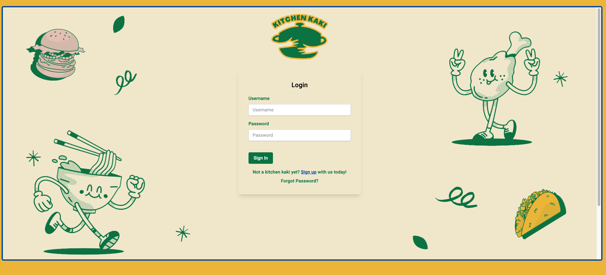  
*JWT auth and password encryption*

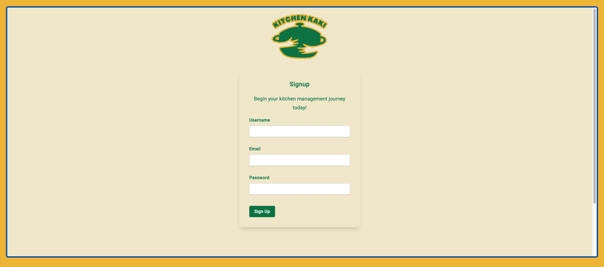  

# Dashboard
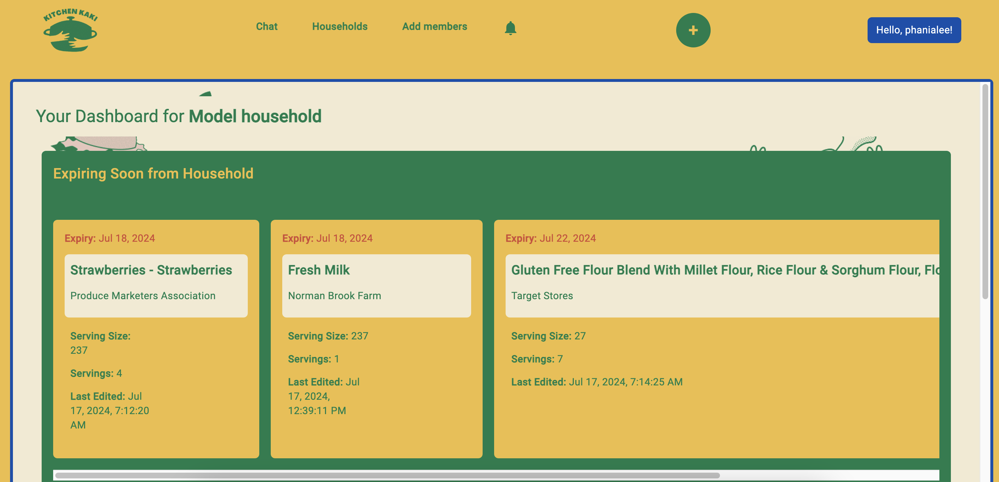  
*Highlights expiring items to reduce waste.*
*Work in progress: Alert for expired food items.*

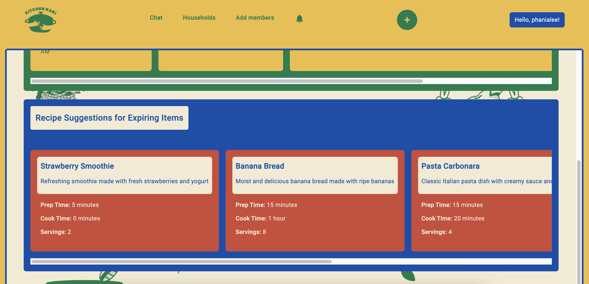  
*Work in progress: Displays recommended recipes based on expiring items to facilitate users to clear their inventory.*
*Incorporate AI or other external APIs.*

*Work in progress: Display latest updated households associated with user.*

# Household Management
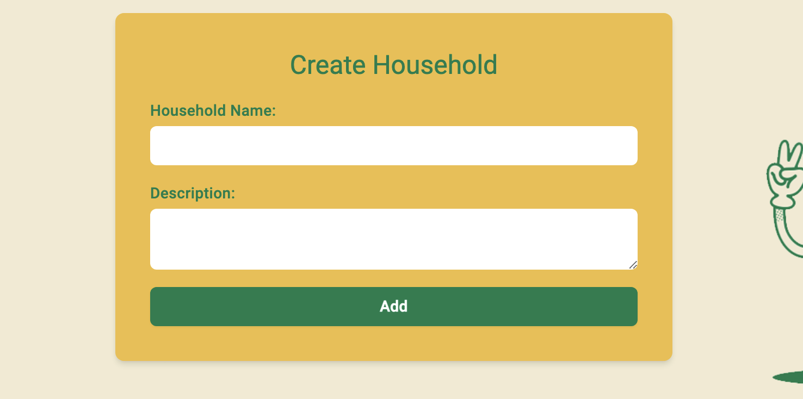  
*Facilitates the creation of a new household.*

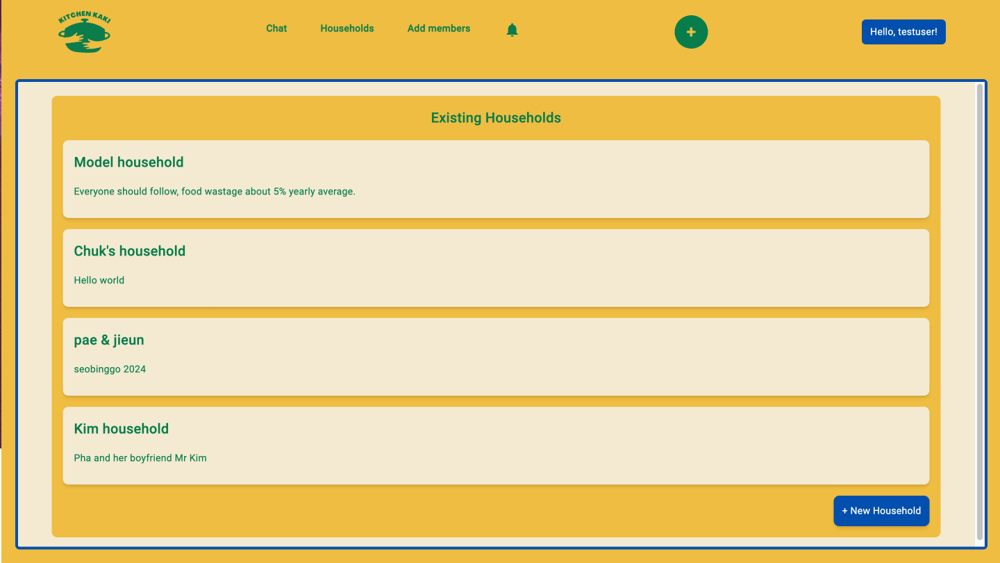  
*Retrieves all household information associated with the logged in user as one user may belong to multiple households.*

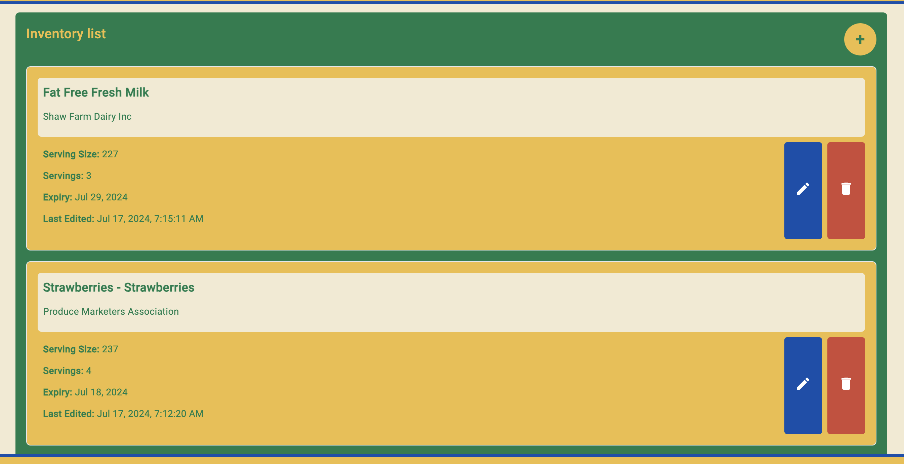  
*Allows users to manage their household inventory.*

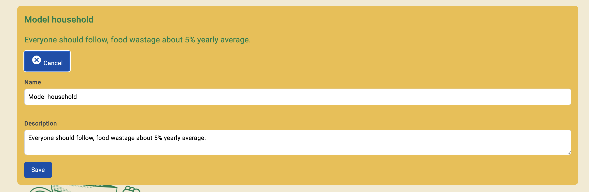  
*Enables editing of household details.*

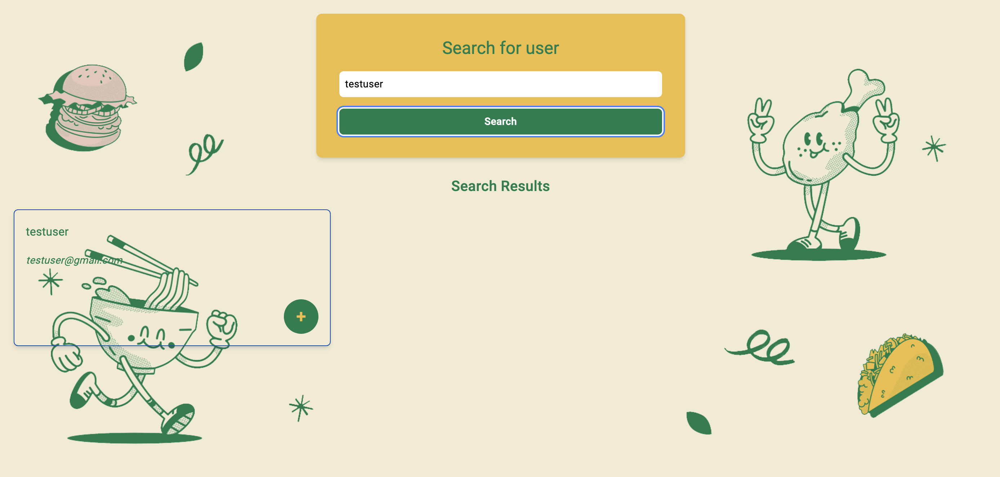  
*Enables searching for other user profiles to add into household.*

# Ingredient Management

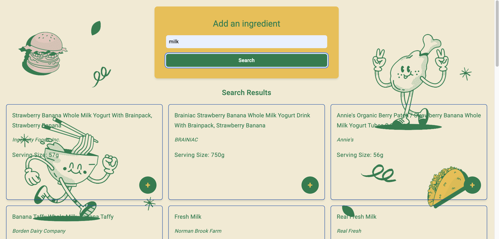  
*Allows users to search for standard supermarket ingredients.*

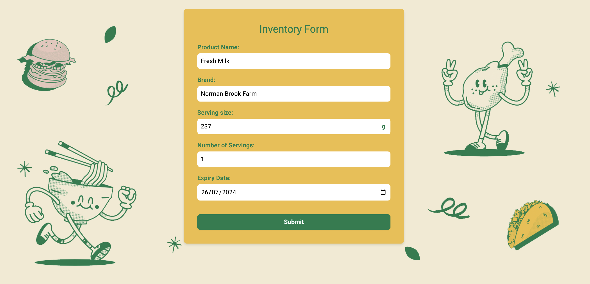  
*User-friendly form where information from standard supermarket ingredients search are populated into their own form to directly add into their inventory.*
*Potential expansion: barcode scan or photo recognition using AI.*

# Live Chat

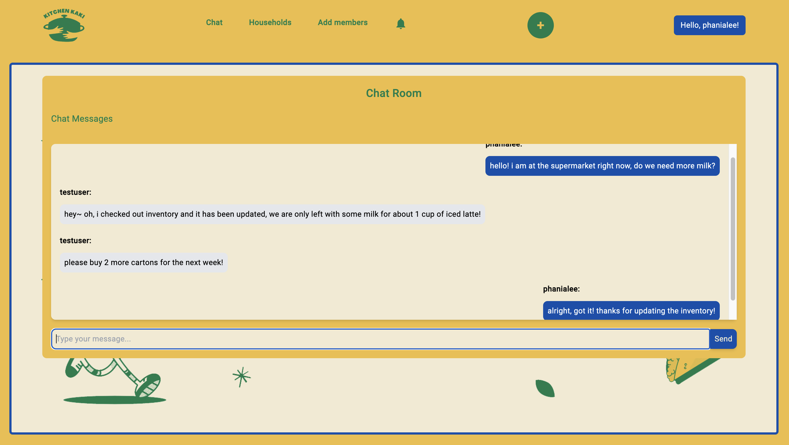  
*Provides real-time chat support for users.*
*Work in progress: Chat history.*

# Notifications

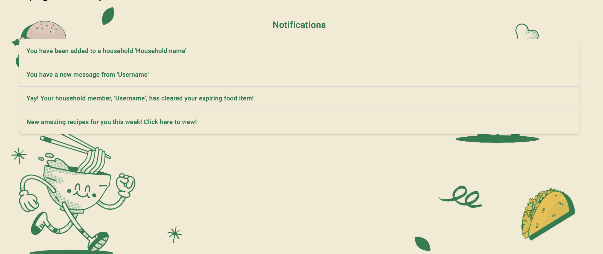  
*Work in progress: Displays alerts and notifications for users.*

# User Entity Diagram
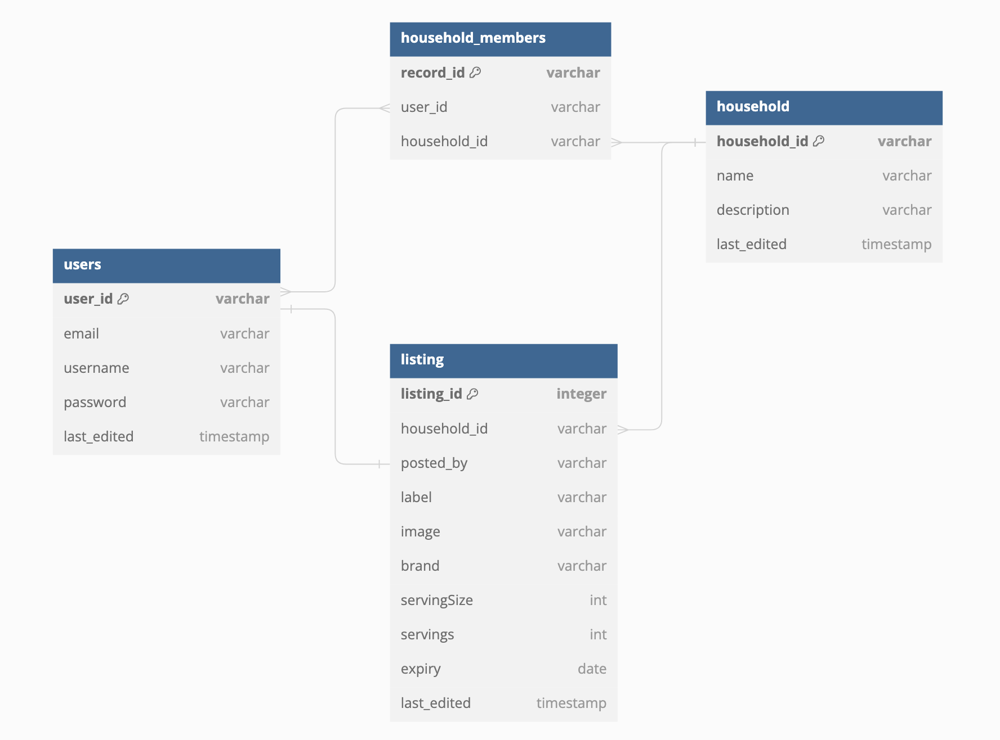  
*User Entity Diagram for MySQL.*

## Future developments

*Google auth*
*Edit user profile*
*Include pictures, Amazon S3*
*Search bar auto-complete or suggestions*
*Chat history*
*Chat scroll to bottom of page when there is new message*
*Loading states*